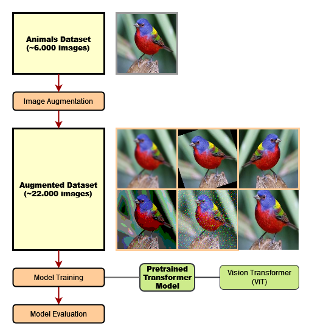

## Vision Transformer for Image Classification

Application for training Google's pretrained Vision Transformer model 
[vit-base-patch16-224-in21k](https://huggingface.co/google/vit-base-patch16-224-in21k) 
(trained on ImageNet-21k, images at resolution 224x224, handed to model in patches of size 16x16) on an
image classification task with a large number of labels.

 

 

The dataset used is [Animals 151](https://www.kaggle.com/sharansmenon/animals141) which contains 6.271 images
of animals labeled as one of 151 different species.

Additional images for the Train Set were created by generating multiple augmented images for each original Train Set image
using one or more randomly selected augmentations from the following six methods (mostly following [this notebook](https://github.com/imjeffhi4/pokemon-classifier/blob/main/data_collection/augment_data.ipynb)):
 - Gaussian Blur
 - Rotation (up to 30° clockwise or counter-clockwise)
 - Horizontal Mirroring
 - Quantizing (reducing number of colors)
 - Gaussian Noise
 - Cropping

For each original Train Set image five augmented images were generated. The Train Set was balanced for all labels beforehand, resulting in an overall training data size of ~22.000 images (144 per species). 

The model was trained for one epoch on the dataset (training time: 03h:27m:07s on NVIDIA GeForce GTX 1660 Ti).

Model training and inference is implemented using the computer vision wrapper [HugsVision](https://github.com/qanastek/HugsVision) which builds on [huggingface](https://huggingface.co/).

 

### Model Evaluation on Test Set

|               Metric              |  vit-base-patch16-224-in21k |
|:---------------------------------:|:---------------------------:|
|            Precision              | 0.76                        |
|            Recall                 | 0.75                        |
|            Micro F1-Score         | 0.72                        |

 

### Requirements

##### - Python >= 3.8

##### - Conda
  - `pytorch==1.7.1`
  - `cudatoolkit=10.1`

##### - pip
  - `transformers`
  - `hugsvision`
  - `pandas`

 

### Notes

The uploaded versions of the original, training and test data in this repository are cut off after the first five categories, the 
real training data contains the beforementioned 151 categories. The trained model file `pytorch_model.bin` is omitted in this repository.
